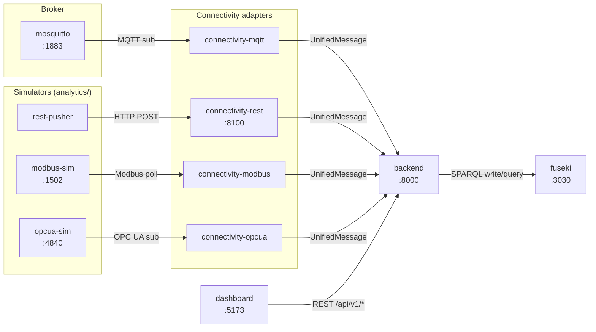

# Port Topology

Port mappings and communication direction across the Docker Compose
stack. Canonical port assignments live in `port-registry.md`; this file
shows how the services wire together.

## Mermaid



## ASCII fallback

```
 Simulators                 Adapters                 Core
 ----------                 --------                 ----
 modbus-sim :1502  --Modbus--> connectivity-modbus --+
 opcua-sim  :4840  --OPC UA--> connectivity-opcua  --+
 rest-pusher       --HTTP---->  connectivity-rest    +--> backend :8000
 mosquitto  :1883  --MQTT----> connectivity-mqtt   --+        |
                                                              |  SPARQL
                                                              v
                                                          fuseki :3030

 dashboard :5173  --REST /api/v1/*-->  backend :8000
```

## Externally exposed host ports

| Port | Service | Protocol |
|---:|---|---|
| 1883 | mosquitto | MQTT |
| 1502 | modbus-sim | Modbus TCP |
| 4840 | opcua-sim | OPC UA |
| 8100 | connectivity-rest | HTTP |
| 8000 | backend | HTTP / REST |
| 3030 | fuseki | HTTP / SPARQL |
| 5173 | dashboard | HTTP |

Direction summary: simulators feed adapters over their native protocol,
adapters normalise to `UnifiedMessage` and POST to the backend, the
backend persists to SQLite and writes/queries triples in Fuseki, and the
dashboard reads everything back through `/api/v1/*`.
